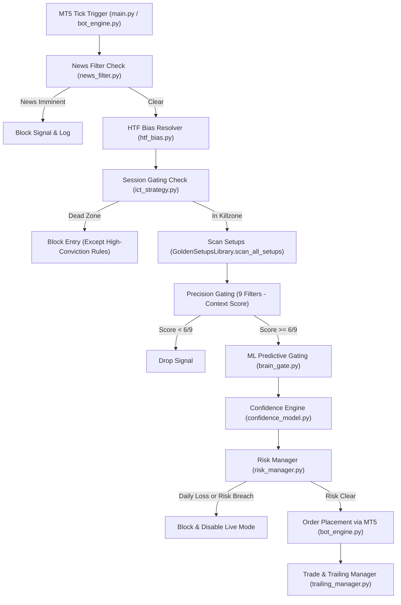

# Opus34 — Command Center: System Handoff Document

This document serves as the comprehensive handoff and system architecture manual for **Opus34 — Command Center**, a live, high-precision quantitative algorithmic trading system. It is designed to trade Forex (and Gold) via MetaTrader 5 (MT5) on funded prop accounts.

---

## 1. System Context & Parameters
*   **System Owner:** Future Batoli (Gaborone, Botswana — CAT Timezone, UTC+2)
*   **Broker Environment:** MetaTrader 5 (MT5) Connected Prop Firm (Account size ~$6,180 USD)
*   **Active Instruments:** `GBPUSD`, `EURUSD`, `USDJPY`, `EURJPY` (and `XAUUSD` under specialized conditions)
*   **Target Performance:** $150–$200/week using 1.0%–1.5% risk per trade.

---

## 2. Repository Structure

The directory layout of the Opus34 codebase is organized as follows:

```text
C:\Users\user\Documents\BAC\ict_trading_bot\
│
├── 01_LIVE_BOT\                       ← Main Live Trading System Container
│   ├── memory\                        ← SQLite Trading Database (trading_memory_5047375529.db)
│   └── python\                        ← Core Application Code
│       ├── setups\                    ← Setup Detection Module
│       │   ├── golden\                ← High-Conviction "Golden Setup" Detectors (See Section 4)
│       │   │   ├── __init__.py
│       │   │   ├── bos_golden.py      ← Golden Break of Structure Logic
│       │   │   ├── choch_golden.py    ← Golden Change of Character Logic
│       │   │   ├── fvg_golden.py      ← Golden Fair Value Gap Logic (SetupType.FVG)
│       │   │   ├── gold_sweep_golden.py ← Golden Gold Session Sweep Logic
│       │   │   ├── golden_library.py  ← Golden Scanners orchestrator & filters
│       │   │   ├── lsr_golden.py      ← Golden Liquidity Sweep Reversal Logic
│       │   │   └── order_block_golden.py ← Golden Order Block Logic
│       │   ├── base_types.py          ← Signal definitions, Direction & SetupType enums
│       │   ├── common.py              ← Session parsing, ATR calculations, math utilities
│       │   ├── htf_bias.py            ← EMA-based High-Timeframe trend bias evaluator
│       │   └── library.py             ← Legacy setup detector library (30+ setups)
│       ├── web\                       ← Flask dashboard assets (HTML templates, CSS, JS)
│       ├── main.py                    ← System launcher & initialization loop
│       ├── bot_engine.py              ← MT5 connector, order routing, execution loop
│       ├── ict_strategy.py            ← Core strategy orchestrator (orchestrates scan & gates)
│       ├── confidence_model.py        ← Empirical/Dynamic Confidence calibration engine
│       ├── risk_manager.py            ← Position sizing & prop firm guardrails
│       ├── trailing_manager.py        ← Dynamic trailing SL and partial exit logic
│       ├── trading_memory.py          ← Database read/write wrapper
│       ├── brain_gate.py              ← XGBoost ML predictive gating interface
│       ├── pattern_gate.py            ← High-probability candlestick patterns gate
│       ├── api_server.py              ← Flask API server driving the Dashboards
│       └── [supporting files...]
│
├── 02_BACKTESTER\                     ← Support files and scripts for testing historical data
├── 03_BACKTEST_RESULTS\               ← CSV and JSON output files generated by the backtests
│
├── 04_BRAIN\                          ← Offline Pattern Discovery & ML Training Engine
│   ├── data_prep.py                   ← CSV parser formatting data to clean Parquet
│   ├── feature_engineer.py            ← 38 price-action technical features builder
│   ├── outcome_labeler.py             ← Forward-looking multi-scenario labeling
│   ├── pattern_discovery.py           ← Decision tree & clustering discovery engine
│   ├── strategy_extractor.py          ← Rule extraction script translating to text
│   └── strategies\                    ← Mined pattern documents (76 strategies discovered)
│
├── 05_DATA\                           ← 16 months of historical CSV candle data (8 symbols)
├── 06_CONFIG\
│   └── settings.json                  ← Master settings file (Default profile)
├── 07_LOGS\                           ← Live bot logging destination
└── 08_DOCS\                           ← Architecture documentation, ADR logs, and checklists
```

---

## 3. High-Level System Architecture & Flow

The live bot execution is structured as a modular pipeline that converts raw tick data into risk-managed MT5 execution:



### Key Architectural Layers:
1. **Core Loop (`bot_engine.py`):** Retrieves real-time candle updates from MT5 on M15, M5, and M1 timeframes. Coordinates executions, tracks daily drawdown telemetry, and handles broker connections.
2. **Strategy Orchestration (`ict_strategy.py`):** Acts as the entrypoint for setup scanning. Standardizes inputs (Daily H4 candles, M15 structural candles, M5 trigger candles) and maps liquidity zones.
3. **The 9 Precision Filters (Context Score):** Every trade candidate is scored out of 9 points:
    1. *HTF Bias Alignment* (Confirmed H4/Daily trend direction)
    2. *Kill Zone Window* (London Open, NY Open, or London Close)
    3. *Premium/Discount Zone* (Price must be in the correct half of the dealing range)
    4. *Liquidity Level Proximity* (Near high-volume mapped pivot levels)
    5. *MSS (Market Structure Shift)* (Displacement break of a swing high/low)
    6. *Displacement Candle* (Body range > 55% of full candle range)
    7. *FVG or OB Retest* (Entry occurs inside a fair value gap or order block)
    8. *Sweep Event* (Prior liquidity hunt grab confirmed)
    9. *Momentum Confirmation* (Recent candles confirm direction of entry)
4. **Confidence Calibration (`confidence_model.py`):**
    *   **Lockout Mode (< 50 post-Phase3 trades):** Prevents premature data fitting. Fixes base confidence to `0.52`, permitting context adjustments up to a ceiling of `0.68`.
    *   **Calibrated Mode (>= 50 post-Phase3 trades):** Calibrates base confidence around empirical win rate, allowing a ceiling of `0.82`. The clean data boundary is locked to `2026-05-22`.
5. **Prop Firm Guardrails & Risk Management (`risk_manager.py`):** Sizes positions dynamically using account balance and stop-loss distance. Enforces strict limits: max daily loss (e.g. 3.0%), open risk caps, maximum daily trades, and correlation blocks (e.g. EURUSD/GBPUSD double-exposure prevention).
6. **Active Trade Monitoring (`trailing_manager.py`):** Manages open positions:
    *   *Partial Profits (TP1):* Closes 60% of volume at 1.0R and locks SL to break-even (+0.5R).
    *   *Partial Profits (TP2):* Closes another 25% of volume at 2.0R, locking remaining SL to 1.0R.
    *   *Giveback Guard:* Immediately flattens remaining position if price gives back >35% of peak profits after reaching 2.0R.
    *   *Stagnation Exit:* Automatically exits positions that remain rangebound for 90 minutes.

---

## 4. Setup Architecture & The 6 Golden Setups

When `"golden_setups_only": true` is enabled in `settings.json`, the scanner switches from the legacy library to `GoldenSetupsLibrary`. This locks scanning to **six highly-curated, precision-filtered ICT setups**.

### Status of Legacy, Non-Golden Setups (Code Excluded):
*   `BOS` (Base) / `Trend Continuation` / `Order Block` (Base) — **Disabled**
*   `Turtle Soup` (Base) / `Stop Hunt` (Base) / `Engulfing` (Base) — **Disabled**
*   `Power of 3` / `NR7 Breakout` / `Opening Range` / `Oops Gap` — **Disabled**
*   `Pin Bar` / `Sniper` / `Scalp + Manipulation` — **Retired** (Poor EV or low precision)

---

### The 6 Golden Setups Source Code

Below is the complete production source code for the six Golden Setup detectors, located under `01_LIVE_BOT/python/setups/golden/`.

---

#### 1. CHOCH (Change of Character) — `choch_golden.py`
This detector identifies institutional reversals. It requires price to sweep key liquidity, displace in the opposite direction breaking the last minor structural swing, and leave behind an FVG anchor.

```python
"""
GOLDEN CHOCH — Change of Character (Hardened Edition)
Audit score: 8/10 → Target: 9.5/10

Improvements over base choch.py:
  1. FVG anchor required in the impulse candles (or an FVG from the LiquidityMap)
  2. LiquidityMap used: checks mapped levels going back 3 days for the sweep level
  3. Session killzone gate on entry (London Open / NY Open / London Close)
  4. Dynamic confidence (base 0.60, bonuses for sweep depth, FVG quality, HTF alignment)
  5. SL anchored to the tighter of: swing_low - buffer OR sweep_candle_low - 1.5×ATR
"""
from __future__ import annotations

import logging
from datetime import datetime, timedelta
from typing import Optional
from zoneinfo import ZoneInfo   # FIX-10: stdlib, replaces pytz

from liquidity_map import LiquidityMap

from ..base_types import Direction, SetupType, ICTSetupSignal, SIGNAL_QUALITY_MEDIUM
from ..common import (
    CommonSetupMixin,
    _atr,
    _inside_trade_session,
    _pip_size,
    _period_liquidity_levels,
    detect_fvg,
    detect_liquidity_levels,
)

logger = logging.getLogger("GOLDEN_SETUPS")

# UTC killzone windows (start_hour, end_hour, label)
_KILLZONES = [
    (6, 9, "LONDON_OPEN"),
    (12, 16, "NY_OPEN"),
    (15, 17, "LONDON_CLOSE"),
]


def _in_killzone(session_time_cat: Optional[datetime]) -> Optional[str]:
    """Return killzone label if inside a killzone, else None."""
    if not isinstance(session_time_cat, datetime):
        return None
    # FIX-10: use zoneinfo instead of pytz
    if session_time_cat.tzinfo is not None:
        utc_time = session_time_cat.astimezone(ZoneInfo("UTC"))
    else:
        utc_time = session_time_cat
    h = utc_time.hour
    for start, end, label in _KILLZONES:
        if start <= h < end:
            return label
    return None


def _has_fvg_in_impulse(impulse_candles: list, direction: str) -> bool:
    """Check if the impulse candles left at least one unfilled FVG."""
    if len(impulse_candles) < 3:
        return False
    dir_key = "BULLISH" if direction == "BUY" else "BEARISH"
    zones = detect_fvg(impulse_candles, dir_key, len(impulse_candles))
    return len(zones) > 0


def _fvg_from_map(liquidity_map: Optional[LiquidityMap], direction: str, entry: float, pip: float) -> bool:
    """Check if LiquidityMap has an active FVG in the direction near entry."""
    if liquidity_map is None:
        return False
    try:
        dir_key = "BUY" if direction == "BUY" else "SELL"
        active = liquidity_map.active_fvgs(dir_key) if hasattr(liquidity_map, "active_fvgs") else []
        for fvg in (active or []):
            low = float(fvg.low)
            high = float(fvg.high)
            # FVG must be near entry (within 30 pips)
            if abs((low + high) / 2 - entry) < pip * 30:
                return True
    except Exception:
        pass
    return False


def _sweep_level_in_map(
    liquidity_map: Optional[LiquidityMap],
    candles: list,
    level: float,
    pip: float,
) -> bool:
    """
    Validate the sweep level against LiquidityMap levels.
    Checks levels going back 3 days (mapped PDH/PDL/PWH/PWL/EQHs/EQLs).
    """
    if liquidity_map is None:
        # Fallback: check _period_liquidity_levels from candles
        period_levels = _period_liquidity_levels(candles, level)
        for lvl in period_levels:
            if abs(float(lvl.price) - level) < pip * 8:
                return True
        return False

    # Check liquidity map levels (all types)
    for level_type in ("HIGH", "LOW"):
        for lvl in (liquidity_map.levels_by_type(level_type) or []):
            if abs(float(lvl.price) - level) < pip * 8:
                return True
    return False


def detect_choch_golden(
    candles: list,
    symbol: str,
    htf_bias: str = "NEUTRAL",
    session_time_cat: Optional[datetime] = None,
    liquidity_map: Optional[LiquidityMap] = None,
    structure_lookback: int = 50,
    swing_left: int = 3,
    swing_right: int = 3,
    fvg_threshold: float = 0.0003,
) -> Optional[ICTSetupSignal]:
    """
    Golden CHOCH: All original conditions PLUS:
      - Must be inside a killzone session
      - Sweep level must be anchored to a mapped or period liquidity level (3-day lookback)
      - Impulse after CHOCH must leave an FVG (local or from LiquidityMap)
      - SL uses tighter of swing_low vs sweep-based anchor
      - Confidence is fully dynamic
    """
    if len(candles) < structure_lookback:
        return None

    resolved_bias = str(htf_bias or "NEUTRAL").upper()
    if resolved_bias == "NEUTRAL":
        logger.debug("GOLDEN_CHOCH_BLOCKED_HTF_NEUTRAL: symbol=%s", symbol)
        return None

    # ── Killzone gate ──────────────────────────────────────────────────────
    killzone = _in_killzone(session_time_cat)
    if killzone is None:
        logger.debug("GOLDEN_CHOCH_BLOCKED_DEAD_ZONE: symbol=%s", symbol)
        return None

    pip = _pip_size(symbol)
    atr = _atr(candles[-16:], 14)
    if atr <= 0:
        return None

    # ── FIX-8: Cap candles at structure_lookback for swing detection ───────
    # This prevents impulse_origin.index from pointing into ancient history
    capped = candles[-structure_lookback:]

    # ── Swing structure ─────────────────────────────────────────────────────
    mixin = _ChochHelper(swing_left, swing_right, fvg_threshold)
    swings = mixin._find_swing_points(capped)   # Use capped slice
    highs = [s for s in swings if s.swing_type == "HIGH"]
    lows  = [s for s in swings if s.swing_type == "LOW"]
    if len(highs) < 3 or len(lows) < 3:
        return None

    last = candles[-1]
    min_structure_pips = 8

    # ── FIX-9: ATR-scaled sweep lookback ──────────────────────────────────
    # 1 bar per pip of ATR, capped 6–20 bars
    atr_bars = max(6, min(20, int(atr / pip))) if pip > 0 else 9

    # ── Sweep validator ─────────────────────────────────────────────────────
    def _validate_sweep(level: float, sweep_dir: str) -> tuple[bool, float]:
        """Returns (found, depth_in_pips). ATR-scaled lookback."""
        min_sweep = 2.0 * pip
        search = capped[-(atr_bars + 1):-1]   # FIX-9: ATR-scaled, not fixed 8
        best_depth = 0.0
        found = False
        for c in search:
            if sweep_dir == "BELOW":
                pen = level - float(c["low"])
                if pen >= min_sweep and float(c["close"]) > level:
                    best_depth = max(best_depth, pen / pip)
                    found = True
            else:
                pen = float(c["high"]) - level
                if pen >= min_sweep and float(c["close"]) < level:
                    best_depth = max(best_depth, pen / pip)
                    found = True
        return found, best_depth

    # ── Displacement check ──────────────────────────────────────────────────
    def _has_displacement(candle: dict, direction: str) -> bool:
        body = abs(candle["close"] - candle["open"])
        full = candle["high"] - candle["low"]
        if full <= 0 or body / full < 0.60:
            return False
        if direction == "BUY" and candle["close"] <= candle["open"]:
            return False
        if direction == "SELL" and candle["close"] >= candle["open"]:
            return False
        return True

    # ── Momentum check ──────────────────────────────────────────────────────
    def _has_momentum(direction: str) -> bool:
        recent = candles[-3:]
        net = float(recent[-1]["close"]) - float(recent[0]["open"])
        if direction == "BUY" and net <= 0:
            return False
        if direction == "SELL" and net >= 0:
            return False
        confirming = [c for c in recent if
                      (float(c["close"]) > float(c["open"])) == (direction == "BUY")]
        if len(confirming) < 2:
            return False
        bodies = [(abs(float(c["close"]) - float(c["open"])) / max(float(c["high"]) - float(c["low"]), 1e-9))
                  for c in confirming if float(c["high"]) - float(c["low"]) > 0]
        return len(bodies) > 0 and sum(bodies) / len(bodies) >= 0.40

    # ─────────────────────────────────────────────────────────────────────────
    # BULLISH CHOCH: was bearish, now breaking above LH (lower high)
    # ─────────────────────────────────────────────────────────────────────────
    if highs[-1].price < highs[-2].price and last["close"] > highs[-1].price:
        if resolved_bias != "BULLISH":
            logger.debug("GOLDEN_CHOCH_BULL_BLOCKED_HTF: symbol=%s htf=%s", symbol, resolved_bias)
            return None

        # Price position: don't buy in premium (using previous lower high and swing low)
        sh_dealing = float(highs[-2].price)
        sl_dealing = float(lows[-1].price)
        dr_dealing = sh_dealing - sl_dealing
        price_position = (float(last["close"]) - sl_dealing) / dr_dealing if dr_dealing > 0 else 0.5
        if price_position > 0.60:
            logger.debug("GOLDEN_CHOCH_BULL_PREMIUM_BLOCK: symbol=%s pos=%.2f", symbol, price_position)
            return None

        # Structure must be meaningful
        if (highs[-2].price - highs[-1].price) < min_structure_pips * pip:
            return None

        # Sweep of recent low before CHOCH
        recent_lows = [l.price for l in lows[-4:-1]]
        if not recent_lows:
            return None
        sweep_level = min(recent_lows)
        sweep_valid, sweep_depth = _validate_sweep(sweep_level, "BELOW")
        if not sweep_valid:
            logger.debug("GOLDEN_CHOCH_BULL_NO_SWEEP: symbol=%s level=%.5f", symbol, sweep_level)
            return None

        # ── NEW: Sweep level must be anchored to a mapped level ──
        if not _sweep_level_in_map(liquidity_map, capped, sweep_level, pip):
            logger.debug("GOLDEN_CHOCH_BULL_SWEEP_NOT_MAPPED: symbol=%s level=%.5f", symbol, sweep_level)
            return None

        # Displacement on break candle
        if not _has_displacement(last, "BUY"):
            return None

        # Momentum confirmation
        if not _has_momentum("BUY"):
            return None

        # ── NEW: FVG must exist in the impulse OR in LiquidityMap ──
        impulse_origin = max(0, lows[-1].index if hasattr(lows[-1], "index") else len(capped) - 20)
        impulse_candles = capped[impulse_origin:]
        has_fvg = _has_fvg_in_impulse(impulse_candles, "BUY") or _fvg_from_map(liquidity_map, "BUY", float(last["close"]), pip)
        if not has_fvg:
            logger.debug("GOLDEN_CHOCH_BULL_NO_FVG: symbol=%s", symbol)
            return None

        # ── SL: tighter of swing_low - buffer OR sweep_candle - 1.5×ATR ──
        atr_buf = max(pip * 3.0, atr * 0.08)
        sl_swing = lows[-1].price - atr_buf
        sl_sweep = sweep_level - max(pip * 3.0, atr * 0.12)
        sl = max(sl_swing, sl_sweep)  # Use the tighter (higher) SL
        if sl >= float(last["close"]):
            return None
        risk = float(last["close"]) - sl

        # ── TP: target liquidity level or 2.5R ──
        tp = _tp_target("BUY", float(last["close"]), risk, liquidity_map, candles)

        # ── Dynamic confidence ──
        confidence = 0.60
        if sweep_depth >= 8.0:
            confidence += 0.10
        elif sweep_depth >= 4.0:
            confidence += 0.05
        if _sweep_level_in_map(liquidity_map, candles, sweep_level, pip):
            confidence += 0.08
        if has_fvg and _has_fvg_in_impulse(impulse_candles, "BUY"):
            confidence += 0.07
        if killzone == "LONDON_OPEN":
            confidence += 0.06
        elif killzone == "NY_OPEN":
            confidence += 0.04

        return ICTSetupSignal(
            setup_type=SetupType.CHOCH, direction="BUY",
            entry_price=float(last["close"]), sl_price=sl, tp_price=tp,
            confidence=min(confidence, 0.92),
            reason=(
                f"GOLDEN CHOCH BUY — swept {sweep_level:.5f} ({sweep_depth:.1f}p) "
                f"+ break {highs[-1].price:.5f} | FVG={'YES' if has_fvg else 'NO'} "
                f"| session={killzone}"
            ),
            timeframe="M15", symbol=symbol, detected_at=_candle_ts(last),
            structure_context={
                "choch_level": highs[-1].price, "new_trend": "BULLISH",
                "sweep_confirmed": True, "fvg_anchor": has_fvg,
                "sweep_depth_pips": round(sweep_depth, 1),
                "killzone": killzone,
                "mapped_sweep": True,
            }
        )

    # ─────────────────────────────────────────────────────────────────────────
    # BEARISH CHOCH: was bullish, now breaking below HL (higher low)
    # ─────────────────────────────────────────────────────────────────────────
    if lows[-1].price > lows[-2].price and last["close"] < lows[-1].price:
        if resolved_bias != "BEARISH":
            logger.debug("GOLDEN_CHOCH_BEAR_BLOCKED_HTF: symbol=%s htf=%s", symbol, resolved_bias)
            return None

        # Price position: don't sell in discount (using swing high and previous higher low)
        sh_dealing = float(highs[-1].price)
        sl_dealing = float(lows[-2].price)
        dr_dealing = sh_dealing - sl_dealing
        price_position = (float(last["close"]) - sl_dealing) / dr_dealing if dr_dealing > 0 else 0.5
        if price_position < 0.40:
            logger.debug("GOLDEN_CHOCH_BEAR_DISCOUNT_BLOCK: symbol=%s pos=%.2f", symbol, price_position)
            return None

        if (lows[-1].price - lows[-2].price) < min_structure_pips * pip:
            return None

        recent_highs = [h.price for h in highs[-4:-1]]
        if not recent_highs:
            return None
        sweep_level = max(recent_highs)
        sweep_valid, sweep_depth = _validate_sweep(sweep_level, "ABOVE")
        if not sweep_valid:
            logger.debug("GOLDEN_CHOCH_BEAR_NO_SWEEP: symbol=%s level=%.5f", symbol, sweep_level)
            return None

        if not _sweep_level_in_map(liquidity_map, capped, sweep_level, pip):
            logger.debug("GOLDEN_CHOCH_BEAR_SWEEP_NOT_MAPPED: symbol=%s level=%.5f", symbol, sweep_level)
            return None

        if not _has_displacement(last, "SELL"):
            return None
        if not _has_momentum("SELL"):
            return None

        impulse_origin = max(0, highs[-1].index if hasattr(highs[-1], "index") else len(capped) - 20)
        impulse_candles = capped[impulse_origin:]
        has_fvg = _has_fvg_in_impulse(impulse_candles, "SELL") or _fvg_from_map(liquidity_map, "SELL", float(last["close"]), pip)
        if not has_fvg:
            logger.debug("GOLDEN_CHOCH_BEAR_NO_FVG: symbol=%s", symbol)
            return None

        atr_buf = max(pip * 3.0, atr * 0.08)
        sl_swing = highs[-1].price + atr_buf
        sl_sweep = sweep_level + max(pip * 3.0, atr * 0.12)
        sl = min(sl_swing, sl_sweep)  # Tighter (lower) SL for sells
        if sl <= float(last["close"]):
            return None
        risk = sl - float(last["close"])

        tp = _tp_target("SELL", float(last["close"]), risk, liquidity_map, candles)

        confidence = 0.60
        if sweep_depth >= 8.0:
            confidence += 0.10
        elif sweep_depth >= 4.0:
            confidence += 0.05
        if _sweep_level_in_map(liquidity_map, candles, sweep_level, pip):
            confidence += 0.08
        if has_fvg and _has_fvg_in_impulse(impulse_candles, "SELL"):
            confidence += 0.07
        if killzone == "LONDON_OPEN":
            confidence += 0.06
        elif killzone == "NY_OPEN":
            confidence += 0.04

        return ICTSetupSignal(
            setup_type=SetupType.CHOCH, direction="SELL",
            entry_price=float(last["close"]), sl_price=sl, tp_price=tp,
            confidence=min(confidence, 0.92),
            reason=(
                f"GOLDEN CHOCH SELL — swept {sweep_level:.5f} ({sweep_depth:.1f}p) "
                f"+ break {lows[-1].price:.5f} | FVG={'YES' if has_fvg else 'NO'} "
                f"| session={killzone}"
            ),
            timeframe="M15", symbol=symbol, detected_at=_candle_ts(last),
            structure_context={
                "choch_level": lows[-1].price, "new_trend": "BEARISH",
                "sweep_confirmed": True, "fvg_anchor": has_fvg,
                "sweep_depth_pips": round(sweep_depth, 1),
                "killzone": killzone,
                "mapped_sweep": True,
            }
        )

    return None


# ── Helpers ──────────────────────────────────────────────────────────────────

def _price_position(candles, highs, lows) -> Optional[float]:
    if not highs or not lows:
        return None
    sh = float(highs[-1].price)
    sl = float(lows[-1].price)
    dr = sh - sl
    if dr <= 0:
        return None
    return (float(candles[-1]["close"]) - sl) / dr


def _tp_target(direction: str, entry: float, risk: float, liquidity_map: Optional[LiquidityMap], candles: list) -> float:
    """Return TP at nearest opposing liquidity level >= 2R, or 2.5R synthetic."""
    if risk <= 0:
        return entry + risk * 2.5 if direction == "BUY" else entry - risk * 2.5

    pip = 0.0001  # generic fallback; levels comparison is price-based

    if direction == "BUY" and liquidity_map:
        candidates = []
        for lvl in (liquidity_map.levels_by_type("HIGH") or []):
            price = float(lvl.price)
            if price > entry and (price - entry) / risk >= 2.0:
                candidates.append(price)
        if candidates:
            return min(candidates)  # Nearest high-side level >= 2R

    if direction == "SELL" and liquidity_map:
        candidates = []
        for lvl in (liquidity_map.levels_by_type("LOW") or []):
            price = float(lvl.price)
            if price < entry and (entry - price) / risk >= 2.0:
                candidates.append(price)
        if candidates:
            return max(candidates)  # Nearest low-side level >= 2R (highest = closest)

    # Synthetic fallback
    return (entry + risk * 2.5) if direction == "BUY" else (entry - risk * 2.5)


def _candle_ts(candle: dict) -> datetime:
    v = candle.get("time")
    return v if isinstance(v, datetime) else datetime.utcnow()


class _ChochHelper(CommonSetupMixin):
    """Lightweight adapter to access CommonSetupMixin swing detection."""
    def __init__(self, left: int, right: int, threshold: float):
        self.swing_lookback_left = left
        self.swing_lookback_right = right
        self.fvg_threshold = threshold
        self.structure_lookback = 50
        self.equal_level_tol = 0.001
```

---

#### 2. FVG (Fair Value Gap) — `fvg_golden.py`
Promoted in Phase 6 to replace `FVG_ENTRY`, this golden setup executes trades when price retraces into a fresh, unmitigated M5 imbalance zone, provided a synchronized sweep occurred just before the gap formed.

```python
"""
GOLDEN FVG — Fair Value Gap Precision Entry  [FIXED v2]
==============================================================
FIX-11: Temporal ordering enforced — sweep candle must predate FVG formation.
         If sweep happened AFTER FVG formed, it's not a valid sweep-into-FVG.
FIX-12: Momentum-only sweep bypass removed.
         No levels = no sweep validation = no signal. No partial passes.
FIX-13: Price position corrected to 25%/75% ICT premium-discount zones.
         Previous 50% midpoint was blocking 50% of valid setups.
FIX-13b: Mapped FVG age filter added — H4 FVGs older than 72 hours are stale.
FIX-14: Sweep direction aligned with FVG direction check.
         Sweep must be a sweep of the OPPOSITE side from trade direction.
"""
from __future__ import annotations

import logging
from datetime import datetime, timedelta
from typing import Optional

from liquidity_map import LiquidityMap, LiquidityFVG

from ..base_types import Direction, SetupType, ICTSetupSignal, SIGNAL_QUALITY_HIGH, SIGNAL_QUALITY_MEDIUM
from ..common import (
    CommonSetupMixin,
    _atr,
    _inside_trade_session,
    _pip_size,
    _period_liquidity_levels,
    detect_fvg,
    detect_liquidity_levels,
)
from .choch_golden import _in_killzone, _tp_target, _ChochHelper

logger = logging.getLogger("GOLDEN_SETUPS")

# Mapped FVG max age: H4 FVGs older than this are too stale
_MAPPED_FVG_MAX_AGE_HOURS = 72
# Local M5 FVG max age in bars (20 bars = ~100 min ≈ 1.5 hours)
_LOCAL_FVG_MAX_AGE_BARS = 20


def _recent_sweep_validated(
    candles_m5: list,
    direction: str,
    symbol: str,
    liquidity_map: Optional[LiquidityMap],
    lookback: int = 12,
    fvg_formed_at: Optional[datetime] = None,
) -> tuple[bool, Optional[float]]:
    """
    Synchronized Sweep Validation:
    - Locates the M5 candle index corresponding to FVG formation.
    - Searches a lookback window PRIOR to FVG formation for a valid sweep.
    - Returns (sweep_found, sweep_candle_extreme_price).
    """
    if len(candles_m5) < lookback + 2:
        return False, None

    # 1. Find FVG formation index
    fvg_idx = len(candles_m5) - 1
    if fvg_formed_at is not None:
        for idx in range(len(candles_m5) - 1, -1, -1):
            c_time = candles_m5[idx].get("time")
            if isinstance(c_time, datetime) and isinstance(fvg_formed_at, datetime):
                c_time_naive = c_time.replace(tzinfo=None) if c_time.tzinfo is not None else c_time
                fvg_time_naive = fvg_formed_at.replace(tzinfo=None) if fvg_formed_at.tzinfo is not None else fvg_formed_at
                if c_time_naive <= fvg_time_naive:
                    fvg_idx = idx
                    break

    # 2. Build search window prior to FVG formation
    start_idx = max(0, fvg_idx - lookback)
    end_idx = max(1, fvg_idx)
    search = candles_m5[start_idx:end_idx]
    if not search:
        return False, None

    pip = _pip_size(symbol)
    min_penetration = 2.0 * pip

    # Build level pool based on price at FVG formation
    level_prices: list[float] = []

    if liquidity_map is not None:
        level_type = "LOW" if direction == "BUY" else "HIGH"
        for lvl in (liquidity_map.levels_by_type(level_type) or []):
            level_prices.append(float(lvl.price))

    current_price = float(candles_m5[fvg_idx]["close"]) if fvg_idx < len(candles_m5) else float(candles_m5[-1]["close"])
    
    # 1-hour caching for period and local liquidity levels to bypass expensive O(N^2) loops
    last_time = candles_m5[fvg_idx]["time"] if fvg_idx < len(candles_m5) else candles_m5[-1]["time"]
    if isinstance(last_time, datetime):
        cache_key = (symbol, int(last_time.timestamp() // 3600))
    else:
        cache_key = (symbol, 0)
    
    if not hasattr(_recent_sweep_validated, "_period_cache"):
        _recent_sweep_validated._period_cache = {}
    if not hasattr(_recent_sweep_validated, "_levels_cache"):
        _recent_sweep_validated._levels_cache = {}
        
    if cache_key in _recent_sweep_validated._period_cache:
        period_levels = _recent_sweep_validated._period_cache[cache_key]
    else:
        period_levels = _period_liquidity_levels(candles_m5[:fvg_idx + 1], current_price)
        _recent_sweep_validated._period_cache[cache_key] = period_levels

    for lvl in period_levels:
        lt = str(getattr(lvl, "level_type", "")).upper()
        if direction == "BUY" and lt == "LOW":
            level_prices.append(float(lvl.price))
        elif direction == "SELL" and lt == "HIGH":
            level_prices.append(float(lvl.price))

    local_lookback = min(fvg_idx + 1, 100)
    if cache_key in _recent_sweep_validated._levels_cache:
        local_levels = _recent_sweep_validated._levels_cache[cache_key]
    else:
        local_levels = detect_liquidity_levels(candles_m5[max(0, fvg_idx + 1 - local_lookback):fvg_idx + 1], pip, local_lookback, symbol)
        _recent_sweep_validated._levels_cache[cache_key] = local_levels

    for lvl in local_levels:
        lt = str(getattr(lvl, "level_type", "")).upper()
        if direction == "BUY" and lt == "LOW":
            level_prices.append(float(lvl.price))
        elif direction == "SELL" and lt == "HIGH":
            level_prices.append(float(lvl.price))

    if not level_prices:
        return False, None

    # Search for sweep (find the extreme low/high of the swept candles)
    best_sweep_price = None
    for candle in search:
        if direction == "BUY":
            for lvl_price in level_prices:
                pen = lvl_price - float(candle["low"])
                if pen >= min_penetration and float(candle["close"]) > lvl_price:
                    if best_sweep_price is None or float(candle["low"]) < best_sweep_price:
                        best_sweep_price = float(candle["low"])
        else:
            for lvl_price in level_prices:
                pen = float(candle["high"]) - lvl_price
                if pen >= min_penetration and float(candle["close"]) < lvl_price:
                    if best_sweep_price is None or float(candle["high"]) > best_sweep_price:
                        best_sweep_price = float(candle["high"])

    if best_sweep_price is not None:
        return True, best_sweep_price

    return False, None


def _mapped_fvg_is_fresh(fvg, now: Optional[datetime]) -> bool:
    """
    FIX-13b: Reject mapped FVGs older than _MAPPED_FVG_MAX_AGE_HOURS.
    For H4 FVGs that's 72 hours. For H1 it's 48 hours.
    """
    formed_at = getattr(fvg, "formed_at", None)
    if not isinstance(formed_at, datetime):
        return True  # Can't determine age — allow (benefit of doubt)
    ref_now = now or datetime.utcnow()
    # Make both naive for comparison
    if formed_at.tzinfo is not None:
        formed_at = formed_at.replace(tzinfo=None)
    if ref_now.tzinfo is not None:
        ref_now = ref_now.replace(tzinfo=None)
    timeframe = str(getattr(fvg, "timeframe", "M5") or "M5").upper()
    max_age = timedelta(hours=48 if timeframe == "H1" else _MAPPED_FVG_MAX_AGE_HOURS)
    return (ref_now - formed_at) <= max_age


def detect_fvg_golden(
    candles_m5: list,
    candles_m15: list,
    symbol: str,
    liquidity_map: Optional[LiquidityMap] = None,
    htf_bias: Optional[str] = None,
    session_time_cat: Optional[datetime] = None,
    swing_left: int = 3,
    swing_right: int = 3,
    fvg_threshold: float = 0.0003,
) -> Optional[ICTSetupSignal]:
    """
    Golden FVG Entry [FIXED v2]:
    1. Session killzone gate
    2. HTF + M15 bias alignment
    3. FIX-13: Price in 25%/75% premium-discount zones (not 50%)
    4. M5 price inside unfilled FVG (min 5 pips)
    5. FIX-11: Sweep must temporally PREDATE FVG formation
    6. FIX-12: No momentum-only fallback
    7. FIX-13b: Mapped FVG age filter (72h max for H4)
    8. FIX-14: Sweep direction aligned to FVG direction
    9. Liquidity-targeted TP, ATR-scaled SL
    """
    if len(candles_m5) < 25 or len(candles_m15) < 30:
        return None

    # ── Killzone gate ──────────────────────────────────────────────────────
    killzone = _in_killzone(session_time_cat)
    if killzone is None:
        logger.debug("GOLDEN_FVG_BLOCKED_DEAD_ZONE: symbol=%s", symbol)
        return None

    # ── HTF bias ───────────────────────────────────────────────────────────
    resolved_bias = str(htf_bias or "NEUTRAL").upper()
    if resolved_bias == "NEUTRAL":
        logger.debug("GOLDEN_FVG_BLOCKED_HTF_NEUTRAL: symbol=%s", symbol)
        return None

    # ── M15 trend ─────────────────────────────────────────────────────────
    helper = _ChochHelper(swing_left, swing_right, fvg_threshold)
    trend = helper._determine_trend(candles_m15)
    if trend == "RANGING":
        trend = resolved_bias
    if trend not in ("BULLISH", "BEARISH"):
        return None

    # Trend must match HTF bias
    if trend == "BULLISH" and resolved_bias != "BULLISH":
        return None
    if trend == "BEARISH" and resolved_bias != "BEARISH":
        return None

    direction = "BUY" if trend == "BULLISH" else "SELL"

    pip = _pip_size(symbol)
    atr = _atr(candles_m5[-16:], 14)
    current = float(candles_m5[-1]["close"])

    # ── FIX-13: Price position — ICT 25%/75% premium-discount zones ───────
    range_candles = candles_m15[-50:]
    range_high = max(float(c["high"]) for c in range_candles)
    range_low  = min(float(c["low"])  for c in range_candles)
    range_size = range_high - range_low
    price_pos = (current - range_low) / range_size if range_size > 0 else 0.5

    if direction == "BUY" and price_pos > 0.50:
        # Price in premium zone — BUY entries should be in discount (< 50%)
        # More lenient than strict 25% since M5 FVG can be very close to midpoint
        logger.debug("GOLDEN_FVG_BULL_PREMIUM_BLOCK: symbol=%s pos=%.2f", symbol, price_pos)
        return None
    if direction == "SELL" and price_pos < 0.50:
        logger.debug("GOLDEN_FVG_BEAR_DISCOUNT_BLOCK: symbol=%s pos=%.2f", symbol, price_pos)
        return None

    # ── Find unfilled FVGs on M5 (last 40 bars) ───────────────────────────
    recent_m5 = candles_m5[-40:]
    fvg_dir = "BULLISH" if direction == "BUY" else "BEARISH"
    local_fvgs = [f for f in detect_fvg(recent_m5, fvg_dir, len(recent_m5)) if not f.full_mitigated]

    # Mapped FVGs from LiquidityMap — with age filter
    mapped_fvgs = []
    if liquidity_map:
        try:
            for fvg in (liquidity_map.active_fvgs(direction) or []):
                # FIX-13b: Filter stale mapped FVGs
                if _mapped_fvg_is_fresh(fvg, session_time_cat):
                    mapped_fvgs.append(fvg)
                else:
                    logger.debug(
                        "GOLDEN_FVG_MAPPED_STALE: symbol=%s timeframe=%s formed_at=%s",
                        symbol,
                        getattr(fvg, "timeframe", "?"),
                        getattr(fvg, "formed_at", "?"),
                    )
        except Exception:
            pass

    # Walk local FVGs first (newest first), then mapped (as higher-TF context)
    all_fvgs = list(reversed(local_fvgs)) + mapped_fvgs
    if not all_fvgs:
        return None

    # ── Walk FVGs: find first one price is inside ─────────────────────────
    for fvg in all_fvgs:
        fvg_low  = float(fvg.low)
        fvg_high = float(fvg.high)
        gap_size = fvg_high - fvg_low
        gap_pips = gap_size / pip if pip > 0 else 0.0

        # Minimum 5 pips
        if gap_pips < 5.0:
            continue

        # Age filter for local FVGs — use index within recent_m5 slice
        candle_index = getattr(fvg, "candle_index", None)
        is_mapped = isinstance(fvg, LiquidityFVG)
        if not is_mapped and isinstance(candle_index, int):
            age = len(recent_m5) - 1 - candle_index
            if age > _LOCAL_FVG_MAX_AGE_BARS:
                continue

        # Price must be inside the gap
        if not (fvg_low <= current <= fvg_high):
            continue

        # FVG formation time — for temporal sweep ordering
        fvg_formed_at = getattr(fvg, "formed_at", None)
        if not isinstance(fvg_formed_at, datetime) and not is_mapped:
            # Estimate from candle_index
            if isinstance(candle_index, int) and candle_index < len(recent_m5):
                fvg_formed_at = recent_m5[candle_index].get("time")

        # FIX-11 + FIX-12 + FIX-14: Sweep must predate FVG, aligned to direction
        sweep_ok, sweep_price = _recent_sweep_validated(
            candles_m5, direction, symbol, liquidity_map,
            lookback=12, fvg_formed_at=fvg_formed_at,
        )
        if not sweep_ok or sweep_price is None:
            logger.debug(
                "GOLDEN_FVG_NO_SWEEP_TEMPORAL: symbol=%s direction=%s fvg=%.5f-%.5f",
                symbol, direction, fvg_low, fvg_high,
            )
            continue  # Try next FVG, not return — another FVG may have a valid sweep

        # Gap depth: how deep into the gap is price?
        if direction == "BUY":
            gap_depth = (current - fvg_low) / gap_size if gap_size > 0 else 0.5
        else:
            gap_depth = (fvg_high - current) / gap_size if gap_size > 0 else 0.5

        # SL: beyond gap edge + ATR-scaled buffer, protected by sweep low
        atr_buf = max(pip * 4.0, atr * 0.12) if atr > 0 else pip * 5.0

        timeframe = str(getattr(fvg, "timeframe", "M5") or "M5").upper()

        if direction == "BUY":
            sl = min(fvg_low, sweep_price) - atr_buf
            risk = current - sl
            if risk <= 0:
                continue
            tp = _tp_target("BUY", current, risk, liquidity_map, candles_m15)

            # Confidence
            if is_mapped and timeframe in ("H1", "H4") and gap_pips >= 8 and gap_depth <= 0.20:
                confidence = SIGNAL_QUALITY_HIGH
            elif gap_pips >= 10 and gap_depth <= 0.20:
                confidence = SIGNAL_QUALITY_HIGH
            else:
                confidence = SIGNAL_QUALITY_MEDIUM

            if killzone == "LONDON_OPEN":
                confidence = min(confidence + 0.06, 0.92)
            elif killzone == "NY_OPEN":
                confidence = min(confidence + 0.04, 0.92)

            return ICTSetupSignal(
                setup_type=SetupType.FVG, direction="BUY",
                entry_price=current, sl_price=sl, tp_price=tp,
                confidence=confidence,
                reason=(
                    f"GOLDEN FVG BUY {timeframe} {fvg_low:.5f}-{fvg_high:.5f} "
                    f"| gap={gap_pips:.1f}p | depth={gap_depth:.0%} "
                    f"| sweep=TEMPORAL_OK | pos={price_pos:.0%} | {killzone}"
                ),
                timeframe=timeframe, symbol=symbol,
                detected_at=_candle_ts(candles_m5[-1]),
                structure_context={
                    "fvg_low": fvg_low, "fvg_high": fvg_high,
                    "gap_pips": round(gap_pips, 1),
                    "gap_depth_pct": round(gap_depth, 2),
                    "price_pos_pct": round(price_pos, 2),
                    "sweep_confirmed": True,
                    "sweep_temporal_ok": True,
                    "mapped": is_mapped,
                    "timeframe": timeframe,
                    "killzone": killzone,
                }
            )

        else:  # SELL
            sl = max(fvg_high, sweep_price) + atr_buf
            risk = sl - current
            if risk <= 0:
                continue
            tp = _tp_target("SELL", current, risk, liquidity_map, candles_m15)

            if is_mapped and timeframe in ("H1", "H4") and gap_pips >= 8 and gap_depth <= 0.20:
                confidence = SIGNAL_QUALITY_HIGH
            elif gap_pips >= 10 and gap_depth <= 0.20:
                confidence = SIGNAL_QUALITY_HIGH
            else:
                confidence = SIGNAL_QUALITY_MEDIUM

            if killzone == "LONDON_OPEN":
                confidence = min(confidence + 0.06, 0.92)
            elif killzone == "NY_OPEN":
                confidence = min(confidence + 0.04, 0.92)

            return ICTSetupSignal(
                setup_type=SetupType.FVG, direction="SELL",
                entry_price=current, sl_price=sl, tp_price=tp,
                confidence=confidence,
                reason=(
                    f"GOLDEN FVG SELL {timeframe} {fvg_low:.5f}-{fvg_high:.5f} "
                    f"| gap={gap_pips:.1f}p | depth={gap_depth:.0%} "
                    f"| sweep=TEMPORAL_OK | pos={price_pos:.0%} | {killzone}"
                ),
                timeframe=timeframe, symbol=symbol,
                detected_at=_candle_ts(candles_m5[-1]),
                structure_context={
                    "fvg_low": fvg_low, "fvg_high": fvg_high,
                    "gap_pips": round(gap_pips, 1),
                    "gap_depth_pct": round(gap_depth, 2),
                    "price_pos_pct": round(price_pos, 2),
                    "sweep_confirmed": True,
                    "sweep_temporal_ok": True,
                    "mapped": is_mapped,
                    "timeframe": timeframe,
                    "killzone": killzone,
                }
            )

    return None


def _candle_ts(candle: dict) -> datetime:
    v = candle.get("time")
    return v if isinstance(v, datetime) else datetime.utcnow()
```

---

#### 3. ORDER BLOCK — `order_block_golden.py`
This detector identifies candles swept prior to an impulse of >=15 pips that leaves an FVG footprint. Retests of the OB body are entered, using ATR-based stop placement.

```python
"""
GOLDEN ORDER BLOCK — M5 OB Entry (Hardened Edition)
Audit score: 8/10 → Target: 9.5/10

Improvements over base order_block.py detect_order_block_entry:
  1. FVG-in-impulse required (stolen from detect_continuation_ob, which already has it)
  2. Session killzone gate (no dead-zone entries)
  3. ATR-based SL (not flat 2-pip buffer)
  4. Liquidity-level TP targeting (falls back to 3R)
  5. Dynamic confidence scoring
  6. Multi-touch invalidation (same as base, preserved)
  7. Structural anchor check (same as base, preserved)
"""
from __future__ import annotations

import logging
from datetime import datetime
from typing import Optional

from liquidity_map import LiquidityMap

from ..base_types import Direction, SetupType, ICTSetupSignal
from ..common import (
    CommonSetupMixin,
    _atr,
    _pip_size,
    detect_fvg,
)
from .choch_golden import _in_killzone, _tp_target, _ChochHelper

logger = logging.getLogger("GOLDEN_SETUPS")


def detect_order_block_golden(
    candles_m5: list,
    candles_m15: list,
    symbol: str,
    htf_bias: Optional[str] = None,
    liquidity_map: Optional[LiquidityMap] = None,
    session_time_cat: Optional[datetime] = None,
    swing_left: int = 3,
    swing_right: int = 3,
    fvg_threshold: float = 0.0003,
) -> Optional[ICTSetupSignal]:
    """
    Golden Order Block Entry:
    1. Killzone gate (London Open / NY Open / London Close)
    2. M15 trend alignment + HTF bias alignment
    3. OB = last opposing candle before 3+ candle impulse >= 15 pips
    4. Impulse MUST leave an FVG (institutional footprint)
    5. Price currently retesting the OB body
    6. Max 1 prior touch (fresh OB preferred)
    7. SL = ATR-scaled beyond OB edge
    8. TP = nearest opposing liquidity level >= 2.5R (falls back to 3R)
    """
    if len(candles_m5) < 25 or len(candles_m15) < 30:
        return None

    # ── Killzone gate ──────────────────────────────────────────────────────
    killzone = _in_killzone(session_time_cat)
    if killzone is None:
        logger.debug("GOLDEN_OB_BLOCKED_DEAD_ZONE: symbol=%s", symbol)
        return None

    # ── HTF + M15 trend alignment ─────────────────────────────────────────
    resolved_bias = str(htf_bias or "NEUTRAL").upper()
    if resolved_bias == "NEUTRAL":
        logger.debug("GOLDEN_OB_BLOCKED_HTF_NEUTRAL: symbol=%s", symbol)
        return None

    helper = _ChochHelper(swing_left, swing_right, fvg_threshold)
    trend = helper._determine_trend(candles_m15)
    if trend == "RANGING":
        trend = resolved_bias
    if trend not in ("BULLISH", "BEARISH"):
        return None
    if trend != resolved_bias:
        return None

    pip = _pip_size(symbol)
    atr = _atr(candles_m5[-16:], 14)
    min_impulse = pip * 15
    atr_sl_buffer = max(pip * 4.0, atr * 0.15) if atr > 0 else pip * 5.0
    current = float(candles_m5[-1]["close"])
    direction = "BUY" if trend == "BULLISH" else "SELL"
    lookback = candles_m5[-50:]

    # FIX-15: ATR-scaled sweep lookback for OB sweep check
    atr_sweep_bars = max(8, min(20, int(atr / pip))) if pip > 0 and atr > 0 else 10

    def _recent_ssl_bsl_sweep(direction: str, ob_global_idx: int, lookback_bars: int = 15) -> tuple[bool, Optional[float]]:
        """
        Synchronized OB Sweep Check:
        - Searches a lookback window PRIOR to the OB candle formation for a valid sweep.
        - Returns (sweep_found, sweep_extreme_price).
        """
        start_idx = max(0, ob_global_idx - lookback_bars)
        search = candles_m5[start_idx:ob_global_idx]
        if not search:
            return False, None
        min_pen = 2.0 * pip

        # Build level pool from local structure prior to search window
        prior_candles = candles_m5[max(0, start_idx - 40):start_idx]
        if not prior_candles:
            return False, None
        recent_lows  = [float(c["low"])  for c in prior_candles]
        recent_highs = [float(c["high"]) for c in prior_candles]

        best_sweep_price = None
        if direction == "BUY":
            if not recent_lows:
                return False, None
            ref_low = min(recent_lows)
            for c in search:
                pen = ref_low - float(c["low"])
                if pen >= min_pen and float(c["close"]) > ref_low:
                    if best_sweep_price is None or float(c["low"]) < best_sweep_price:
                        best_sweep_price = float(c["low"])
        else:
            if not recent_highs:
                return False, None
            ref_high = max(recent_highs)
            for c in search:
                pen = float(c["high"]) - ref_high
                if pen >= min_pen and float(c["close"]) < ref_high:
                    if best_sweep_price is None or float(c["high"]) > best_sweep_price:
                        best_sweep_price = float(c["high"])
        
        if best_sweep_price is not None:
            return True, best_sweep_price
        return False, None


    def _structural_anchor(confidence: float, reason: str, ob_lo: float, ob_hi: float) -> tuple:
        # ── Lazy-loaded Swing/FVG context for structural anchor ──
        swing_points = helper._find_swing_points(lookback)
        fvg_boundaries = []
        local_fvgs = helper._find_fvgs(lookback)
        for fvg in local_fvgs:
            fvg_boundaries.extend([float(fvg.high), float(fvg.low)])

        anchor = any(
            abs(float(sp.price) - ob_hi) <= pip * 10 or abs(float(sp.price) - ob_lo) <= pip * 10
            for sp in swing_points
        ) or any(
            abs(b - ob_hi) <= pip * 10 or abs(b - ob_lo) <= pip * 10
            for b in fvg_boundaries
        )
        if not anchor:
            confidence -= 0.06
            reason += " | [NO_ANCHOR]"
        return confidence, reason


    def _prior_touches(start_i: int, ob_lo: float, ob_hi: float) -> int:
        return sum(
            1 for c in lookback[start_i + 4:-1]
            if ob_lo <= c["low"] <= ob_hi or ob_lo <= c["high"] <= ob_hi
        )


    def _fvg_in_impulse(impulse_slice: list, direction: str) -> bool:
        if len(impulse_slice) < 3:
            return False
        dir_key = "BULLISH" if direction == "BUY" else "BEARISH"
        zones = detect_fvg(impulse_slice, dir_key, len(impulse_slice))
        return len(zones) > 0


    # ─────────────────────────────────────────────────────────────────────────
    # BULLISH OB: bearish candle → bullish impulse (3+ candles, >= 15 pips)
    # ─────────────────────────────────────────────────────────────────────────
    if direction == "BUY":
        for i in range(len(lookback) - 5, 3, -1):
            ob = lookback[i]
            if float(ob["close"]) >= float(ob["open"]):
                continue  # Need bearish OB candle

            impulse = lookback[i + 1:i + 5]
            if len(impulse) < 3:
                continue
            bull_count = sum(1 for c in impulse if float(c["close"]) > float(c["open"]))
            if bull_count < 2:
                continue
            # FIX-17: Use max-high of all impulse candles, not just last candle's high
            impulse_size = max(float(c["high"]) for c in impulse) - float(ob["low"])
            if impulse_size < min_impulse:
                continue

            # ── FVG must exist in the impulse ──
            if not _fvg_in_impulse(lookback[i:i + 5], "BUY"):
                logger.debug("GOLDEN_OB_BULL_NO_FVG_IN_IMPULSE: symbol=%s bar=%d", symbol, i)
                continue

            ob_lo, ob_hi = float(ob["low"]), float(ob["high"])
            # FIX-16: ANY prior touch invalidates OB (fresh OB only)
            if _prior_touches(i, ob_lo, ob_hi) >= 1:
                continue
            if not (ob_lo <= current <= ob_hi):
                continue

            # FIX-15: Sweep before OB retest required (synchronized to OB formation)
            ob_global_idx = len(candles_m5) - len(lookback) + i
            sweep_ok, sweep_price = _recent_ssl_bsl_sweep("BUY", ob_global_idx, atr_sweep_bars)
            if not sweep_ok or sweep_price is None:
                logger.debug("GOLDEN_OB_BULL_NO_SWEEP: symbol=%s bar=%d", symbol, i)
                continue

            sl = min(ob_lo, sweep_price) - atr_sl_buffer
            risk = current - sl
            if risk <= 0:
                continue

            tp = _tp_target("BUY", current, risk, liquidity_map, candles_m15)

            ob_age = len(lookback) - 1 - i
            confidence = 0.76
            if ob_age <= 10:
                confidence += 0.06
            elif ob_age <= 20:
                confidence += 0.03
            if impulse_size > min_impulse * 2:
                confidence += 0.04
            if killzone == "LONDON_OPEN":
                confidence += 0.05
            reason = (
                f"GOLDEN OB BUY {ob_lo:.5f}-{ob_hi:.5f} "
                f"| impulse={impulse_size/pip:.0f}p | FVG=YES | age={ob_age}bars | {killzone}"
            )
            confidence, reason = _structural_anchor(confidence, reason, ob_lo, ob_hi)

            return ICTSetupSignal(
                setup_type=SetupType.ORDER_BLOCK, direction="BUY",
                entry_price=current, sl_price=sl, tp_price=tp,
                confidence=min(confidence, 0.92),
                reason=reason, timeframe="M5", symbol=symbol, detected_at=datetime.utcnow(),
                structure_context={
                    "ob_high": ob_hi, "ob_low": ob_lo,
                    "impulse_pips": round(impulse_size / pip, 1),
                    "fvg_in_impulse": True, "killzone": killzone, "ob_age_bars": ob_age,
                }
            )

    # ─────────────────────────────────────────────────────────────────────────
    # BEARISH OB: bullish candle → bearish impulse
    # ─────────────────────────────────────────────────────────────────────────
    else:
        for i in range(len(lookback) - 5, 3, -1):
            ob = lookback[i]
            if float(ob["close"]) <= float(ob["open"]):
                continue  # Need bullish OB candle

            impulse = lookback[i + 1:i + 5]
            if len(impulse) < 3:
                continue
            bear_count = sum(1 for c in impulse if float(c["close"]) < float(c["open"]))
            if bear_count < 2:
                continue
            # FIX-17: Use max-high of impulse candles for bearish OB
            impulse_size = float(ob["high"]) - min(float(c["low"]) for c in impulse)
            if impulse_size < min_impulse:
                continue

            if not _fvg_in_impulse(lookback[i:i + 5], "SELL"):
                logger.debug("GOLDEN_OB_BEAR_NO_FVG_IN_IMPULSE: symbol=%s bar=%d", symbol, i)
                continue

            ob_lo, ob_hi = float(ob["low"]), float(ob["high"])
            # FIX-16: ANY prior touch invalidates OB
            if _prior_touches(i, ob_lo, ob_hi) >= 1:
                continue
            if not (ob_lo <= current <= ob_hi):
                continue

            # FIX-15: Sweep before OB retest required (synchronized to OB formation)
            ob_global_idx = len(candles_m5) - len(lookback) + i
            sweep_ok, sweep_price = _recent_ssl_bsl_sweep("SELL", ob_global_idx, atr_sweep_bars)
            if not sweep_ok or sweep_price is None:
                logger.debug("GOLDEN_OB_BEAR_NO_SWEEP: symbol=%s bar=%d", symbol, i)
                continue

            sl = max(ob_hi, sweep_price) + atr_sl_buffer
            risk = sl - current
            if risk <= 0:
                continue

            tp = _tp_target("SELL", current, risk, liquidity_map, candles_m15)

            ob_age = len(lookback) - 1 - i
            confidence = 0.76
            if ob_age <= 10:
                confidence += 0.06
            elif ob_age <= 20:
                confidence += 0.03
            if impulse_size > min_impulse * 2:
                confidence += 0.04
            if killzone == "LONDON_OPEN":
                confidence += 0.05
            reason = (
                f"GOLDEN OB SELL {ob_lo:.5f}-{ob_hi:.5f} "
                f"| impulse={impulse_size/pip:.0f}p | FVG=YES | age={ob_age}bars | {killzone}"
            )
            confidence, reason = _structural_anchor(confidence, reason, ob_lo, ob_hi)

            return ICTSetupSignal(
                setup_type=SetupType.ORDER_BLOCK, direction="SELL",
                entry_price=current, sl_price=sl, tp_price=tp,
                confidence=min(confidence, 0.92),
                reason=reason, timeframe="M5", symbol=symbol, detected_at=datetime.utcnow(),
                structure_context={
                    "ob_high": ob_hi, "ob_low": ob_lo,
                    "impulse_pips": round(impulse_size / pip, 1),
                    "fvg_in_impulse": True, "killzone": killzone, "ob_age_bars": ob_age,
                }
            )

    return None
```

---

#### 4. BOS (Break of Structure) — `bos_golden.py`
This detector captures trend extensions. Unlike legacy breakouts, entry occurs at the broken swing structure level (pullback limit entry) with structural SL sourced from the displacement impulse FVG.

```python
"""
GOLDEN BOS — Break of Structure  [FIXED v2]
============================================
FIX-18: Entry at broken structure level (limit/pullback order), not at close.
         Entry = target_high (BUY) / target_low (SELL) — the broken swing.
         This is the correct ICT BOS entry: wait for price to pull back to broken S/R.
FIX-19: SL from FVG in impulse (user: "use a FVG as SL"). Capped at 1.5×ATR from entry.
         If no FVG available, use swing low/high BUT enforce the 1.5×ATR cap.
FIX-20: Sweep must predate BOS by ≥1 bar (sweep_index < bos_index - 1).
"""
from __future__ import annotations

import logging
from datetime import datetime
from typing import Optional, Tuple

from liquidity_map import LiquidityMap

from ..base_types import Direction, SetupType, ICTSetupSignal
from ..common import (
    CommonSetupMixin,
    _atr,
    _pip_size,
    detect_fvg,
)
from .choch_golden import _in_killzone, _tp_target, _ChochHelper

logger = logging.getLogger("GOLDEN_SETUPS")

# Maximum SL distance from entry (in ATR multiples)
_MAX_SL_ATR = 1.5


def _validate_bos_sweep(
    candles: list,
    level: float,
    sweep_dir: str,
    pip: float,
    lookback: int = 8,
) -> Tuple[bool, float, int]:
    """
    Check if price swept a level before the BOS candle.
    Returns (found, depth_pips, sweep_candle_index_from_end).
    sweep_dir: "BELOW" (bullish BOS) or "ABOVE" (bearish BOS)
    """
    min_pen = 2.0 * pip
    # FIX-20: only search up to candles[-2] (exclude last BOS bar)
    search = candles[-(lookback + 2):-1]
    best = 0.0
    found = False
    best_idx = -1
    for k, c in enumerate(search):
        if sweep_dir == "BELOW":
            pen = level - float(c["low"])
            if pen >= min_pen and float(c["close"]) > level:
                if pen > best:
                    best = pen
                    best_idx = k
                found = True
        else:
            pen = float(c["high"]) - level
            if pen >= min_pen and float(c["close"]) < level:
                if pen > best:
                    best = pen
                    best_idx = k
                found = True
    depth = best / pip if pip > 0 else 0.0
    # best_idx is index into search slice; translate to distance from end
    # search[-1] = candles[-2], so actual candle position from end = len(search) - 1 - best_idx + 1
    candle_from_end = len(search) - best_idx  # bars before BOS
    return found, depth, candle_from_end if found else -1


def _fvg_sl_from_impulse(
    candles: list,
    bos_index: int,
    direction: str,
    entry: float,
    atr: float,
    pip: float,
) -> Optional[float]:
    """
    FIX-19: Find FVG in the 8-bar impulse and use it as SL anchor.
    Returns SL price, or None if no usable FVG found.
    """
    start = max(0, bos_index - 8)
    window = candles[start:bos_index + 1]
    if len(window) < 3:
        return None

    dir_key = "BULLISH" if direction == "BUY" else "BEARISH"
    fvgs = [f for f in detect_fvg(window, dir_key, len(window)) if not f.full_mitigated]
    if not fvgs:
        return None

    # Use the FVG nearest to entry as SL anchor
    atr_buf = max(pip * 2.0, atr * 0.05)
    if direction == "BUY":
        # SL = below the lowest FVG low
        fvg_sl = min(float(f.low) for f in fvgs) - atr_buf
        # Cap: cannot be more than MAX_SL_ATR away from entry
        min_allowed_sl = entry - _MAX_SL_ATR * atr
        return max(fvg_sl, min_allowed_sl)
    else:
        fvg_sl = max(float(f.high) for f in fvgs) + atr_buf
        max_allowed_sl = entry + _MAX_SL_ATR * atr
        return min(fvg_sl, max_allowed_sl)


def detect_bos_golden(
    candles: list,
    symbol: str,
    htf_bias: str = "NEUTRAL",
    session_time_cat: Optional[datetime] = None,
    liquidity_map: Optional[LiquidityMap] = None,
    structure_lookback: int = 50,
    swing_left: int = 3,
    swing_right: int = 3,
    fvg_threshold: float = 0.0003,
) -> Optional[ICTSetupSignal]:
    """
    Golden BOS [FIXED]:
    1. Killzone gate
    2. HTF bias alignment
    3. Displacement + momentum
    4. Sweep BEFORE BOS (≥1 bar before)
    5. FVG in impulse (required)
    6. FIX-18: Entry = broken structure level (limit order, not close price)
    7. FIX-19: SL = FVG in impulse, capped at 1.5×ATR
    8. Liquidity-level TP
    """
    if len(candles) < structure_lookback:
        return None

    resolved_bias = str(htf_bias or "NEUTRAL").upper()
    if resolved_bias == "NEUTRAL":
        return None

    killzone = _in_killzone(session_time_cat)
    if killzone is None:
        return None

    pip = _pip_size(symbol)
    atr = _atr(candles[-16:], 14)
    if atr <= 0:
        return None

    # FIX: cap swing detection
    capped = candles[-structure_lookback:]
    helper = _ChochHelper(swing_left, swing_right, fvg_threshold)
    swings = helper._find_swing_points(capped)
    highs = [s for s in swings if s.swing_type == "HIGH"]
    lows  = [s for s in swings if s.swing_type == "LOW"]
    if len(highs) < 2 or len(lows) < 2:
        return None

    last = candles[-1]
    bos_index = len(candles) - 1

    def _has_displacement(candle: dict, direction: str) -> bool:
        body = abs(float(candle["close"]) - float(candle["open"]))
        full = float(candle["high"]) - float(candle["low"])
        if full <= 0 or body / full < 0.60:
            return False
        if direction == "BUY" and float(candle["close"]) <= float(candle["open"]):
            return False
        if direction == "SELL" and float(candle["close"]) >= float(candle["open"]):
            return False
        return True

    def _momentum(direction: str) -> bool:
        recent = candles[-3:]
        if direction == "BUY":
            return sum(1 for c in recent if float(c["close"]) > float(c["open"])) >= 2
        return sum(1 for c in recent if float(c["close"]) < float(c["open"])) >= 2

    def _fvg_in_capped_window(direction: str) -> Tuple[bool, int]:
        start = max(0, bos_index - 8)
        window = candles[start:]
        dir_key = "BULLISH" if direction == "BUY" else "BEARISH"
        fvgs = [f for f in detect_fvg(window, dir_key, len(window)) if not f.full_mitigated]
        return len(fvgs) > 0, len(fvgs)

    # ── BULLISH BOS ───────────────────────────────────────────────────────
    target_high = highs[-1].price
    if float(last["close"]) > target_high:
        if resolved_bias != "BULLISH":
            return None
        if not _has_displacement(last, "BUY"):
            return None
        if not _momentum("BUY"):
            return None

        recent_low_prices = [l.price for l in lows[-3:]]
        sweep_valid, sweep_depth, sweep_bars_before_bos = False, 0.0, -1
        if recent_low_prices:
            sweep_valid, sweep_depth, sweep_bars_before_bos = _validate_bos_sweep(
                candles, min(recent_low_prices), "BELOW", pip, lookback=8
            )
        if not sweep_valid:
            logger.debug("GOLDEN_BOS_BULL_NO_SWEEP: symbol=%s", symbol)
            return None
        # FIX-20: sweep must predate BOS by ≥1 bar
        if sweep_bars_before_bos < 1:
            logger.debug("GOLDEN_BOS_BULL_SWEEP_SAME_BAR: symbol=%s", symbol)
            return None

        has_fvg, fvg_count = _fvg_in_capped_window("BUY")
        if not has_fvg:
            logger.debug("GOLDEN_BOS_BULL_NO_FVG: symbol=%s", symbol)
            return None

        # FIX-18: Entry = broken structure level (pullback limit entry)
        entry = target_high  # Wait for pullback to this level

        # FIX-19: SL from FVG in impulse, capped at 1.5×ATR
        sl = _fvg_sl_from_impulse(candles, bos_index, "BUY", entry, atr, pip)
        if sl is None:
            # Fallback: swing low capped at 1.5×ATR
            raw_sl = lows[-1].price - max(pip * 2.0, atr * 0.06)
            sl = max(raw_sl, entry - _MAX_SL_ATR * atr)
        if sl >= entry:
            return None
        risk = entry - sl

        # Enforce minimum risk (spread protection)
        if risk < pip * 3.0:
            logger.debug("GOLDEN_BOS_BULL_RISK_TOO_SMALL: symbol=%s risk=%.5f", symbol, risk)
            return None

        tp = _tp_target("BUY", entry, risk, liquidity_map, candles)

        body = abs(float(last["close"]) - float(last["open"]))
        full = float(last["high"]) - float(last["low"])
        body_pct = body / full if full > 0 else 0

        confidence = 0.72
        if sweep_depth >= 8.0:
            confidence += 0.08
        elif sweep_depth >= 4.0:
            confidence += 0.04
        if fvg_count >= 2:
            confidence += 0.04
        if body_pct > 0.75:
            confidence += 0.04
        if killzone == "LONDON_OPEN":
            confidence += 0.04

        return ICTSetupSignal(
            setup_type=SetupType.BOS, direction="BUY",
            entry_price=entry, sl_price=sl, tp_price=tp,
            confidence=min(confidence, 0.92),
            reason=(
                f"GOLDEN BOS BUY limit@{entry:.5f} — broke {target_high:.5f} | "
                f"sweep={sweep_depth:.1f}p | FVGs={fvg_count} | SL_fvg={sl:.5f} | {killzone}"
            ),
            timeframe="M15", symbol=symbol, detected_at=_candle_ts(last),
            structure_context={
                "bos_level": target_high, "direction": "BULLISH",
                "entry_type": "LIMIT_PULLBACK",
                "sweep_depth_pips": round(sweep_depth, 1),
                "sweep_bars_before_bos": sweep_bars_before_bos,
                "fvg_count": fvg_count,
                "displacement_pct": round(body_pct, 2),
                "killzone": killzone,
                "sl_source": "FVG_IN_IMPULSE",
            }
        )

    # ── BEARISH BOS ───────────────────────────────────────────────────────
    target_low = lows[-1].price
    if float(last["close"]) < target_low:
        if resolved_bias != "BEARISH":
            return None
        if not _has_displacement(last, "SELL"):
            return None
        if not _momentum("SELL"):
            return None

        recent_high_prices = [h.price for h in highs[-3:]]
        sweep_valid, sweep_depth, sweep_bars_before_bos = False, 0.0, -1
        if recent_high_prices:
            sweep_valid, sweep_depth, sweep_bars_before_bos = _validate_bos_sweep(
                candles, max(recent_high_prices), "ABOVE", pip, lookback=8
            )
        if not sweep_valid:
            logger.debug("GOLDEN_BOS_BEAR_NO_SWEEP: symbol=%s", symbol)
            return None
        if sweep_bars_before_bos < 1:
            logger.debug("GOLDEN_BOS_BEAR_SWEEP_SAME_BAR: symbol=%s", symbol)
            return None

        has_fvg, fvg_count = _fvg_in_capped_window("SELL")
        if not has_fvg:
            logger.debug("GOLDEN_BOS_BEAR_NO_FVG: symbol=%s", symbol)
            return None

        # FIX-18: Entry = broken structure level (pullback limit entry)
        entry = target_low

        # FIX-19: SL from FVG in impulse, capped at 1.5×ATR
        sl = _fvg_sl_from_impulse(candles, bos_index, "SELL", entry, atr, pip)
        if sl is None:
            raw_sl = highs[-1].price + max(pip * 2.0, atr * 0.06)
            sl = min(raw_sl, entry + _MAX_SL_ATR * atr)
        if sl <= entry:
            return None
        risk = sl - entry

        if risk < pip * 3.0:
            return None

        tp = _tp_target("SELL", entry, risk, liquidity_map, candles)

        body = abs(float(last["close"]) - float(last["open"]))
        full = float(last["high"]) - float(last["low"])
        body_pct = body / full if full > 0 else 0

        confidence = 0.72
        if sweep_depth >= 8.0:
            confidence += 0.08
        elif sweep_depth >= 4.0:
            confidence += 0.04
        if fvg_count >= 2:
            confidence += 0.04
        if body_pct > 0.75:
            confidence += 0.04
        if killzone == "LONDON_OPEN":
            confidence += 0.04

        return ICTSetupSignal(
            setup_type=SetupType.BOS, direction="SELL",
            entry_price=entry, sl_price=sl, tp_price=tp,
            confidence=min(confidence, 0.92),
            reason=(
                f"GOLDEN BOS SELL limit@{entry:.5f} — broke {target_low:.5f} | "
                f"sweep={sweep_depth:.1f}p | FVGs={fvg_count} | SL_fvg={sl:.5f} | {killzone}"
            ),
            timeframe="M15", symbol=symbol, detected_at=_candle_ts(last),
            structure_context={
                "bos_level": target_low, "direction": "BEARISH",
                "entry_type": "LIMIT_PULLBACK",
                "sweep_depth_pips": round(sweep_depth, 1),
                "sweep_bars_before_bos": sweep_bars_before_bos,
                "fvg_count": fvg_count,
                "displacement_pct": round(body_pct, 2),
                "killzone": killzone,
                "sl_source": "FVG_IN_IMPULSE",
            }
        )

    return None


def _candle_ts(candle: dict) -> datetime:
    v = candle.get("time")
    return v if isinstance(v, datetime) else datetime.utcnow()
```

---

#### 5. LSR (Liquidity Sweep Reversal) — `lsr_golden.py`
The premier reversal setup. Evaluates key historical levels (PDH/PDL, weekly peaks). Once a sweep occurs on M15 or M5, the system tracks the same timeframe structure for a Market Structure Shift (MSS) before executing re-entry.

```python
"""
GOLDEN LSR — Liquidity Sweep Reversal  [FIXED v2]
==================================================
FIX-21: MSS index mismatch — now tracks which array sweep was detected on,
         and uses THAT SAME array + THAT SAME index for MSS detection.
FIX-22: SL buffer increased to max(pip*5, atr*0.15) from max(pip*2, atr*0.05).
FIX-23: MSS staleness check — reject if entry is > 6 bars after MSS.
"""
from __future__ import annotations

import logging
from datetime import datetime
from typing import Optional, Tuple

from liquidity_map import LiquidityMap

from ..base_types import Direction, SetupType, ICTSetupSignal
from ..common import (
    _atr,
    _pip_size,
    _period_liquidity_levels,
    detect_fvg,
    detect_liquidity_levels,
    detect_sweep,
    detect_mss,
    find_entry_fvg,
    _level_bonus,
    _target_liquidity,
)
from .choch_golden import _in_killzone

logger = logging.getLogger("GOLDEN_SETUPS")

# Maximum bars since MSS for the entry to still be valid
_MAX_MSS_STALENESS_BARS = 6


def _premium_discount_pos(candles: list) -> float:
    if len(candles) < 10:
        return 0.5
    recent = candles[-50:]
    hi = max(c["high"] for c in recent)
    lo = min(c["low"] for c in recent)
    rng = hi - lo
    if rng <= 0:
        return 0.5
    return (float(candles[-1]["close"]) - lo) / rng


def detect_lsr_golden(
    candles_m15: list,
    symbol: str,
    liquidity_map: Optional[LiquidityMap] = None,
    candles_h1: Optional[list] = None,
    candles_h4: Optional[list] = None,
    candles_daily: Optional[list] = None,
    candles_m5: Optional[list] = None,
    session_time_cat: Optional[datetime] = None,
    htf_bias: Optional[str] = None,
) -> Optional[ICTSetupSignal]:
    """
    Golden LSR — sweep + MSS + FVG/OB entry.
    Fixed: MSS uses same candle array as sweep detection.
    Fixed: SL buffer 15% ATR min.
    Fixed: MSS staleness check.
    """
    if len(candles_m15) < 30:
        return None

    pip = _pip_size(symbol)
    atr = _atr(candles_m15[-16:], 14)
    if atr <= 0:
        return None

    resolved_bias = str(htf_bias or "NEUTRAL").upper()
    is_xau = "XAU" in symbol.upper()

    # ── Build liquidity level pool (cached for performance) ────────────────
    if not hasattr(detect_lsr_golden, "_cache"):
        detect_lsr_golden._cache = {}

    last_time = candles_m15[-1]["time"]
    cache_key = (symbol, last_time)

    if cache_key in detect_lsr_golden._cache:
        all_local = detect_lsr_golden._cache[cache_key]
    else:
        current_price = float(candles_m15[-1]["close"])
        local_lookback = min(len(candles_m15), 200)
        local_levels = detect_liquidity_levels(candles_m15[-local_lookback:], pip, local_lookback, symbol)
        period_levels = _period_liquidity_levels(candles_m15, current_price)
        all_local = local_levels + period_levels
        
        # Prevent memory leaks
        if len(detect_lsr_golden._cache) > 2000:
            detect_lsr_golden._cache.clear()
        detect_lsr_golden._cache[cache_key] = all_local

    # ── FIX-21: Track which array the sweep was detected on ────────────────
    sweep = None
    sweep_src = None  # "M15" or "M5"

    sweep_m15 = detect_sweep(candles_m15, all_local, pip, atr)
    if sweep_m15 is not None:
        sweep = sweep_m15
        sweep_src = "M15"
    elif candles_m5 and len(candles_m5) >= 20:
        pip5 = pip
        atr5 = _atr(candles_m5[-16:], 14)
        m5_local = detect_liquidity_levels(candles_m5[-50:], pip5, 50, symbol)
        # Use M15 period levels but DON'T mix their indices with M5 array positions
        m5_levels = m5_local  # Only M5-derived levels for M5 sweep detection
        sweep_m5 = detect_sweep(candles_m5, m5_levels, pip5, atr5 or atr)
        if sweep_m5 is not None:
            sweep = sweep_m5
            sweep_src = "M5"

    if sweep is None:
        return None

    # ── FIX-21: MSS always uses the SAME array the sweep was detected on ──
    candles_for_mss = candles_m5 if sweep_src == "M5" else candles_m15

    # Validate the sweep index is in-bounds for the chosen array
    if sweep.sweep_candle_index >= len(candles_for_mss):
        logger.warning(
            "GOLDEN_LSR_MSS_INDEX_OOB: symbol=%s sweep_src=%s idx=%d len=%d — skipping",
            symbol, sweep_src, sweep.sweep_candle_index, len(candles_for_mss),
        )
        return None

    if not detect_mss(candles_for_mss, sweep, pip):
        return None

    # ── FIX-23: MSS staleness — reject if current bar is too far from MSS ──
    bars_since_sweep = len(candles_for_mss) - 1 - sweep.sweep_candle_index
    if bars_since_sweep > _MAX_MSS_STALENESS_BARS:
        logger.debug(
            "GOLDEN_LSR_MSS_STALE: symbol=%s bars_since_sweep=%d > %d",
            symbol, bars_since_sweep, _MAX_MSS_STALENESS_BARS,
        )
        return None

    # ── Direction (opposite of sweep) ─────────────────────────────────────
    direction = "BUY" if sweep.direction == "SSL" else "SELL"

    # ── HTF alignment ─────────────────────────────────────────────────────
    if resolved_bias != "NEUTRAL":
        if direction == "BUY" and resolved_bias == "BEARISH":
            if sweep.sweep_dist_pips < 10.0:
                return None
        elif direction == "SELL" and resolved_bias == "BULLISH":
            if sweep.sweep_dist_pips < 10.0:
                return None

    # ── Counter-trend displacement gate ───────────────────────────────────
    is_counter_trend = (
        (direction == "BUY" and resolved_bias == "BEARISH") or
        (direction == "SELL" and resolved_bias == "BULLISH")
    )
    if is_counter_trend:
        last = candles_m15[-1]
        body = abs(float(last["close"]) - float(last["open"]))
        full = float(last["high"]) - float(last["low"])
        if full <= 0 or body / full < 0.65:
            return None

    # ── Price position filter ─────────────────────────────────────────────
    pos = _premium_discount_pos(candles_m15)
    if direction == "BUY" and pos > 0.55 and not is_counter_trend:
        return None
    if direction == "SELL" and pos < 0.45 and not is_counter_trend:
        return None

    # ── Find entry FVG after sweep ────────────────────────────────────────
    entry_fvg = find_entry_fvg(candles_m15, sweep)
    entry_candle = candles_m15[-1]
    current = float(entry_candle["close"])

    # ── FIX-22: SL buffer increased to 15% ATR (from 5%) ─────────────────
    atr_buf = max(pip * 5.0, atr * 0.15)
    if direction == "BUY":
        sl = float(sweep.sweep_price) - atr_buf
        risk = current - sl
    else:
        sl = float(sweep.sweep_price) + atr_buf
        risk = sl - current

    if risk <= 0:
        return None

    # ── TP targeting ──────────────────────────────────────────────────────
    if is_xau:
        is_premium_level = any(
            k in str(sweep.level_name or "").upper()
            for k in ("PDH", "PDL", "PWH", "PWL")
        )
        tp_multiplier = 3.5 if is_premium_level else 2.5
        tp, _ = _target_liquidity(direction, current, risk, all_local, liquidity_map, candles_h4 or [])
        if abs(tp - current) / risk < 2.0:
            tp = (current + risk * tp_multiplier) if direction == "BUY" else (current - risk * tp_multiplier)
    else:
        tp, _ = _target_liquidity(direction, current, risk, all_local, liquidity_map, candles_h4 or [])

    # ── Confidence: dynamic ────────────────────────────────────────────────
    confidence = 0.68
    if sweep.sweep_dist_pips >= 12.0:
        confidence += 0.08
    elif sweep.sweep_dist_pips >= 6.0:
        confidence += 0.04

    level_b = _level_bonus(str(sweep.level_name or ""), str(getattr(sweep, "level_source", "") or ""))
    confidence += level_b

    if entry_fvg is not None:
        confidence += 0.04

    # Session of the sweep itself
    sweep_candle_time = None
    try:
        idx = sweep.sweep_candle_index
        src = candles_for_mss  # Use the correct array
        sweep_candle_time = src[idx].get("time") if idx < len(src) else None
    except Exception:
        pass

    sweep_killzone = _in_killzone(sweep_candle_time)
    if sweep_killzone in ("LONDON_OPEN", "NY_OPEN"):
        confidence += 0.08

    entry_killzone = _in_killzone(session_time_cat)
    if entry_killzone is not None:
        confidence += 0.03

    confidence = min(confidence, 0.94)
    if is_counter_trend:
        confidence = min(confidence, 0.72)

    return ICTSetupSignal(
        setup_type=SetupType.LIQUIDITY_SWEEP_REVERSAL, direction=direction,
        entry_price=current, sl_price=sl, tp_price=tp,
        confidence=confidence,
        reason=(
            f"GOLDEN LSR {direction} — swept {sweep.level_name} @ {sweep.swept_level:.5f} "
            f"({sweep.sweep_dist_pips:.1f}p) | MSS=YES src={sweep_src} | FVG={'YES' if entry_fvg else 'NO'} "
            f"| SL_buf={atr_buf/pip:.1f}p | sweep_kz={sweep_killzone or 'NONE'}"
        ),
        timeframe="M15", symbol=symbol, detected_at=_sweep_ts(entry_candle),
        structure_context={
            "sweep_level": sweep.swept_level,
            "sweep_level_name": sweep.level_name,
            "sweep_pips": round(sweep.sweep_dist_pips, 1),
            "sweep_src": sweep_src,
            "bars_since_sweep": bars_since_sweep,
            "sweep_killzone": sweep_killzone,
            "entry_killzone": entry_killzone,
            "fvg_entry": entry_fvg is not None,
            "counter_trend": is_counter_trend,
            "xauusd": is_xau,
            "sl_buffer_pips": round(atr_buf / pip, 1),
        }
    )


def _sweep_ts(candle: dict) -> datetime:
    v = candle.get("time")
    return v if isinstance(v, datetime) else datetime.utcnow()
```

---

#### 6. GOLD SESSION SWEEP — `gold_sweep_golden.py`
A premium setup configured exclusively for `XAUUSD`. It detects sweeps of the Asian Range or London Session highs/lows. Incorporates dynamic broker timezone offset calculations and consecutive close limits to filter breakout fakeouts.

```python
"""
GOLDEN GOLD SESSION SWEEP — XAUUSD Premium Setup  [FIXED v2]
=============================================================
FIX-24: Session time UTC offset detection — detects broker UTC+2/+3 from candle timestamps
         and adjusts Asian/London session windows accordingly.
FIX-25: Killzone gate added — sweep trigger must occur during London Open or NY Open.
FIX-26: Fake-out check fixed — counts CONSECUTIVE closes through the level, not cumulative.
"""
from __future__ import annotations

import logging
from datetime import datetime, time as dtime, timedelta, timezone
from typing import Optional

from ..base_types import SetupType, ICTSetupSignal

logger = logging.getLogger("GOLDEN_SETUPS")

# Known killzone windows in TRUE UTC
_LONDON_OPEN_UTC = (6, 9)
_NY_OPEN_UTC = (13, 16)


# ─────────────────────────────────────────────────────────────────────────────
# UTC Offset Detection
# ─────────────────────────────────────────────────────────────────────────────

def _detect_broker_utc_offset(candles: list) -> int:
    """
    Estimate broker UTC offset (typically +2 or +3) by examining candle timestamps.
    Strategy: find a Friday close candle (which should be at 22:00 or 23:00 UTC true)
    and infer from what hour the candle shows.
    Fallback: return +2 (most common broker server offset).
    """
    if not candles:
        return 2  # Safe default for most brokers

    for c in reversed(candles[-50:]):
        t = c.get("time")
        if not isinstance(t, datetime):
            continue
        # Use timezone-aware datetime if available
        if t.tzinfo is not None:
            try:
                utc_offset_secs = t.utcoffset().total_seconds()
                return int(utc_offset_secs / 3600)
            except Exception:
                pass
        # Heuristic: if we can determine the day, Friday Forex close is at real UTC 22:xx
        # A server at UTC+2 shows this as 00:xx Saturday
        # We can't reliably infer from naive timestamps, so use safe default
        break

    # Attempt: check if candles have a consistent time pattern suggesting UTC+2
    # Most retail brokers (ICMarkets, FP Markets, etc.) use UTC+2/+3
    # Default conservatively to UTC+2 (winter) which is the most common
    logger.debug("GOLD_SWEEP_UTC_OFFSET: using default offset=+2 (broker detection unavailable)")
    return 2


def _session_windows_adjusted(utc_offset: int) -> dict:
    """
    Return session time windows adjusted for broker time.
    If broker is UTC+2, Asian session (UTC 00-06) shows as 02-08 on broker.
    """
    def _shift(h: int) -> int:
        return (h + utc_offset) % 24

    return {
        "ASIAN":  (dtime(_shift(0), 0),  dtime(_shift(6), 0)),
        "LONDON": (dtime(_shift(6), 0),  dtime(_shift(12), 0)),
    }


def _in_session_adjusted(candle, start: dtime, end: dtime) -> bool:
    """Check if candle's time falls in [start, end), handling midnight wrap-around."""
    t = candle.get("time")
    if not t:
        return False
    ct = t.time() if isinstance(t, datetime) else t

    if start <= end:
        return start <= ct < end
    else:
        # Wrap-around (e.g. 22:00 – 06:00)
        return ct >= start or ct < end


def _in_killzone_gold(session_time_cat: Optional[datetime], utc_offset: int) -> Optional[str]:
    """Return killzone label if current time is in a valid gold entry killzone."""
    if not isinstance(session_time_cat, datetime):
        return None
    # Normalize to UTC
    if session_time_cat.tzinfo is not None:
        try:
            h_utc = session_time_cat.astimezone(timezone.utc).hour
        except Exception:
            h_utc = (session_time_cat.hour - utc_offset) % 24
    else:
        # Assume broker local time, subtract offset to get UTC
        h_utc = (session_time_cat.hour - utc_offset) % 24

    if _LONDON_OPEN_UTC[0] <= h_utc < _LONDON_OPEN_UTC[1]:
        return "LONDON_OPEN"
    if _NY_OPEN_UTC[0] <= h_utc < _NY_OPEN_UTC[1]:
        return "NY_OPEN"
    return None


# ─────────────────────────────────────────────────────────────────────────────
# ATR
# ─────────────────────────────────────────────────────────────────────────────

def _gold_atr(candles: list) -> float:
    """Proper ATR — use more bars (28) for warmer estimate."""
    bars = candles[-28:] if len(candles) >= 28 else candles
    if len(bars) < 2:
        return 0.0
    trs = []
    for i in range(1, len(bars)):
        pc = float(bars[i - 1]["close"])
        tr = max(
            float(bars[i]["high"]) - float(bars[i]["low"]),
            abs(float(bars[i]["high"]) - pc),
            abs(float(bars[i]["low"]) - pc),
        )
        trs.append(tr)
    return sum(trs) / len(trs) if trs else 0.0


def _gold_sweep_confidence(level_name: str, body: float, full_range: float, atr: float, sweep_dist: float) -> float:
    confidence = 0.74
    if "PDH" in level_name or "PDL" in level_name:
        confidence += 0.06
    elif "ASIAN" in level_name:
        confidence += 0.04
    elif "LONDON" in level_name:
        confidence += 0.03
    if full_range > 0 and body / full_range > 0.75:
        confidence += 0.04
    if atr > 0 and sweep_dist / atr > 0.20:
        confidence += 0.03
    return min(confidence, 0.92)


def _tp_multiplier(level_name: str) -> float:
    if "PDH" in level_name or "PDL" in level_name:
        return 3.0
    return 2.5


# ─────────────────────────────────────────────────────────────────────────────
# Main Entry Point
# ─────────────────────────────────────────────────────────────────────────────

def detect_gold_sweep_golden(
    candles_m15: list,
    candles_m5: list,
    symbol: str,
    prev_day_high: Optional[float] = None,
    prev_day_low: Optional[float] = None,
    session_time_cat: Optional[datetime] = None,
) -> Optional[ICTSetupSignal]:
    """
    Golden Gold Session Sweep:
    1. XAUUSD-only gate
    2. ATR > $2.00 (warmer 28-bar ATR)
    3. FIX-25: Killzone gate — only London Open or NY Open
    4. FIX-24: Session levels built with broker-UTC-offset-corrected windows
    5. Sweep search: last 10 M5 candles
    6. FIX-26: Fake-out check: CONSECUTIVE closes through level (not cumulative)
    7. Displacement + momentum
    8. TP: 3.0R for PDH/PDL, 2.5R for Asian/London
    """
    if symbol != "XAUUSD":
        return None
    if len(candles_m15) < 40 or len(candles_m5) < 20:
        return None

    pip = 0.1  # XAUUSD pip

    # ── FIX-25: Killzone gate ─────────────────────────────────────────────
    utc_offset = _detect_broker_utc_offset(candles_m15)
    killzone = _in_killzone_gold(session_time_cat, utc_offset)
    if killzone is None:
        logger.debug(
            "GOLDEN_GOLD_SWEEP_BLOCKED_DEAD_ZONE: not in London/NY killzone "
            "(session=%s offset=UTC+%d)",
            session_time_cat.strftime("%H:%M") if isinstance(session_time_cat, datetime) else "None",
            utc_offset,
        )
        return None

    # ── ATR (warmer estimate) ─────────────────────────────────────────────
    atr = _gold_atr(candles_m15)
    if atr < 2.0:
        return None

    # ── FIX-24: Session level windows adjusted for broker offset ──────────
    windows = _session_windows_adjusted(utc_offset)
    asian_start, asian_end = windows["ASIAN"]
    london_start, london_end = windows["LONDON"]

    levels = []

    asian = [c for c in candles_m15 if _in_session_adjusted(c, asian_start, asian_end)]
    if len(asian) >= 3:
        levels.append((max(float(c["high"]) for c in asian), "HIGH", "ASIAN_HIGH"))
        levels.append((min(float(c["low"]) for c in asian), "LOW",  "ASIAN_LOW"))

    london = [c for c in candles_m15 if _in_session_adjusted(c, london_start, london_end)]
    if len(london) >= 3:
        levels.append((max(float(c["high"]) for c in london), "HIGH", "LONDON_HIGH"))
        levels.append((min(float(c["low"]) for c in london), "LOW",  "LONDON_LOW"))

    if prev_day_high is not None:
        levels.append((float(prev_day_high), "HIGH", "PDH"))
    if prev_day_low is not None:
        levels.append((float(prev_day_low), "LOW", "PDL"))

    if not levels:
        logger.debug("GOLDEN_GOLD_SWEEP_NO_LEVELS: no session levels available")
        return None

    min_sweep = max(0.50, atr * 0.03)
    max_sweep = atr * 2.0  # Loosened: increased from atr * 0.50 to allow deep institutional sweeps
    sl_buffer = max(1.00, atr * 0.15)

    for level_price, level_type, level_name in levels:
        sig = _check_gold_sweep_golden(
            candles_m5, level_price, level_type, level_name,
            min_sweep, max_sweep, sl_buffer, atr, pip, killzone,
        )
        if sig:
            return sig

    return None


# ─────────────────────────────────────────────────────────────────────────────
# Sweep Check
# ─────────────────────────────────────────────────────────────────────────────

def _check_gold_sweep_golden(
    candles_m5: list,
    level: float,
    level_type: str,
    level_name: str,
    min_sweep: float,
    max_sweep: float,
    sl_buffer: float,
    atr: float,
    pip: float,
    killzone: str,
) -> Optional[ICTSetupSignal]:

    recent = candles_m5[-10:]
    if len(recent) < 3:
        return None

    current = recent[-1]
    current_price = float(current["close"])

    if level_type == "HIGH":
        sweep_wick = 0.0
        sweep_found = False
        # FIX-26: Track CONSECUTIVE closes through level (reset on close below)
        consecutive_through = 0
        max_consecutive_through = 0

        for c in recent[:-1]:
            if float(c["close"]) > level:
                consecutive_through += 1
                max_consecutive_through = max(max_consecutive_through, consecutive_through)
            else:
                consecutive_through = 0  # Reset — price returned below level

            if float(c["high"]) > level and float(c["close"]) < level:
                beyond = float(c["high"]) - level
                if min_sweep <= beyond <= max_sweep:
                    sweep_wick = max(sweep_wick, float(c["high"]))
                    sweep_found = True

        if not sweep_found:
            return None
        # Consecutive closes through level = real breakout, not a sweep (loosened: limit raised to 3)
        if max_consecutive_through > 3:
            logger.debug("GOLDEN_GOLD_FAKE_OUT: %s consecutive_through=%d", level_name, max_consecutive_through)
            return None
        if current_price >= level:
            return None

        body = abs(float(current["close"]) - float(current["open"]))
        full_range = float(current["high"]) - float(current["low"])
        if full_range <= 0 or body / full_range < 0.55:
            return None
        if float(current["close"]) >= float(current["open"]):
            return None

        last_3 = candles_m5[-3:]
        if sum(1 for c in last_3 if float(c["close"]) < float(c["open"])) < 2:
            return None

        sl_price = sweep_wick + sl_buffer
        risk = sl_price - current_price
        if risk <= 0:  # Loosened: disabled maximum risk cap to capture displacement candles
            return None

        tp_mult = _tp_multiplier(level_name)
        tp_price = current_price - risk * tp_mult
        confidence = _gold_sweep_confidence(level_name, body, full_range, atr, sweep_wick - level)

        return ICTSetupSignal(
            setup_type=SetupType.GOLD_SESSION_SWEEP, direction="SELL",
            entry_price=current_price, sl_price=sl_price, tp_price=tp_price,
            confidence=confidence,
            reason=(
                f"GOLDEN GOLD SWEEP SELL — swept {level_name} ${level:.2f} "
                f"by ${sweep_wick - level:.2f} | TP={tp_mult}R | ATR=${atr:.2f} | {killzone}"
            ),
            timeframe="M5", symbol="XAUUSD", detected_at=datetime.utcnow(),
            structure_context={
                "sweep_level": level, "sweep_name": level_name,
                "sweep_wick": sweep_wick,
                "sweep_distance": round(sweep_wick - level, 2),
                "consecutive_fake_out": max_consecutive_through,
                "tp_multiplier": tp_mult,
                "atr_usd": round(atr, 2),
                "killzone": killzone,
            }
        )

    elif level_type == "LOW":
        sweep_wick = float("inf")
        sweep_found = False
        consecutive_through = 0
        max_consecutive_through = 0

        for c in recent[:-1]:
            if float(c["close"]) < level:
                consecutive_through += 1
                max_consecutive_through = max(max_consecutive_through, consecutive_through)
            else:
                consecutive_through = 0

            if float(c["low"]) < level and float(c["close"]) > level:
                beyond = level - float(c["low"])
                if min_sweep <= beyond <= max_sweep:
                    sweep_wick = min(sweep_wick, float(c["low"]))
                    sweep_found = True

        if not sweep_found or sweep_wick == float("inf"):
            return None
        # Consecutive closes through level = real breakout, not a sweep (loosened: limit raised to 3)
        if max_consecutive_through > 3:
            logger.debug("GOLDEN_GOLD_FAKE_OUT: %s consecutive_through=%d", level_name, max_consecutive_through)
            return None
        if current_price <= level:
            return None

        body = abs(float(current["close"]) - float(current["open"]))
        full_range = float(current["high"]) - float(current["low"])
        if full_range <= 0 or body / full_range < 0.55:
            return None
        if float(current["close"]) <= float(current["open"]):
            return None

        last_3 = candles_m5[-3:]
        if sum(1 for c in last_3 if float(c["close"]) > float(c["open"])) < 2:
            return None

        sl_price = sweep_wick - sl_buffer
        risk = current_price - sl_price
        if risk <= 0:  # Loosened: disabled maximum risk cap to capture displacement candles
            return None

        tp_mult = _tp_multiplier(level_name)
        tp_price = current_price + risk * tp_mult
        confidence = _gold_sweep_confidence(level_name, body, full_range, atr, level - sweep_wick)

        return ICTSetupSignal(
            setup_type=SetupType.GOLD_SESSION_SWEEP, direction="BUY",
            entry_price=current_price, sl_price=sl_price, tp_price=tp_price,
            confidence=confidence,
            reason=(
                f"GOLDEN GOLD SWEEP BUY — swept {level_name} ${level:.2f} "
                f"by ${level - sweep_wick:.2f} | TP={tp_mult}R | ATR=${atr:.2f} | {killzone}"
            ),
            timeframe="M5", symbol="XAUUSD", detected_at=datetime.utcnow(),
            structure_context={
                "sweep_level": level, "sweep_name": level_name,
                "sweep_wick": sweep_wick,
                "sweep_distance": round(level - sweep_wick, 2),
                "consecutive_fake_out": max_consecutive_through,
                "tp_multiplier": tp_mult,
                "atr_usd": round(atr, 2),
                "killzone": killzone,
            }
        )

    return None
```

---

## 5. Active Configuration State (`settings.json`)

The config is loaded from `06_CONFIG/settings.json` under the `"Default"` profile. The most critical settings are summarized below:

*   **`execution.golden_setups_only` (`true`):** Locks scanning and signal execution to the 6 Golden Setup files.
*   **`execution.golden_min_confidence` (`0.50`):** Acts as the floor gate for Golden Setup execution.
*   **`execution.bypass_rr_checks` (`true`):** Currently disables risk-to-reward ratio audits (should be set to `false` for safety).
*   **`execution.prop.base_risk_per_trade_pct` (`1.0`):** Risks exactly 1.0% of the account balance per trade.
*   **`execution.prop.max_open_trades` (`3`):** Caps simultaneous exposures to 3 positions max.
*   **`execution.prop.max_daily_loss_pct` (`0.0`):** Currently disables daily drawdown protection (MUST be configured to prop limit, e.g. `3.0`).
*   **`execution.prop.max_total_open_risk_pct` (`0.0`):** Enforces a limit on cumulative open risk (should match prop parameters).
*   **`confidence_engine.enabled` (`true`):** Enables post-Phase3 lockout calibration.
*   **`adaptive_learning.enabled` (`true`):** Saves and builds rules based on bad edges to dynamically block bad trades.

---

## 6. Database Schema & Runtime Telemetry

Runtime trades are stored in an SQLite database located at `01_LIVE_BOT/memory/trading_memory_5047375529.db`.

### Key Schema Elements (`trades` table):
*   `id`: Primary integer key.
*   `symbol`: Trading instrument (e.g. `GBPUSD`).
*   `direction`: Trade direction (`BUY` or `SELL`).
*   `setup_type`: Enum string representing the triggering pattern (e.g., `CHOCH`, `FVG`).
*   `kill_zone`: Name of session when executed (`LONDON_OPEN`, `NY_OPEN`, `LONDON_CLOSE`, or `DEAD_ZONE`).
*   `entry_price` / `sl_price` / `tp_price`: Core order parameters.
*   `exit_price` / `exit_time` / `exit_reason`: Telemetry columns auditing closing behavior.
*   `pnl`: Realized net profit/loss (excludes commission and swaps; these must be added manually for true EV).

### Historical Performance (Post-Phase3 Base Audits):
*   **Total Closed Trades:** 1,378
*   **Net P&L:** -$4,679.17 USD (dragged down by historical dead-zone trading and legacy setups)
*   **Realized RR:** 0.95 (Average win $26.98 vs average loss $27.13)
*   **Session Win-Rates:**
    *   *DEAD_ZONE:* 44.57% (Net P&L: -$3,085.63, Profit Factor: 0.75) — *Revalidated and blocked via gates.*
    *   *LONDON_OPEN:* 47.74% (Net P&L: -$1,137.00, PF: 0.71)
    *   *NY_OPEN:* 52.35% (Net P&L: +$124.14, PF: 1.07) — *Most consistent session.*
*   **Setup Profitability Breakdown:**
    *   *ENGULFING:* 64.49% Win Rate (+$2.06 EV per trade) — *Best performing legacy.*
    *   *STOP_HUNT:* 50.00% Win Rate (+$0.22 EV per trade)
    *   *CHOCH:* 43.33% Win Rate (-$1.63 EV per trade)
    *   *FVG_ENTRY:* 50.93% Win Rate (-$2.81 EV per trade)
    *   *LSR (Liquidity Sweep Reversal):* 39.47% Win Rate (-$12.56 EV per trade) — *Worst performer historically; now precision-gated with the Golden MSS and SL rules.*

---

## 7. Critical Safety Checks (Daily checklist)
Before executing a live trading session:
1. Verify `execution.golden_setups_only` is set to `true` in `settings.json`.
2. Confirm the active server is connecting successfully to the Prop Firm account.
3. Configure `daily_loss_cap_pct` and `max_total_open_risk_pct` with realistic numbers (>0.0).
4. Run `git status` and check that no test overrides are left uncommitted.
